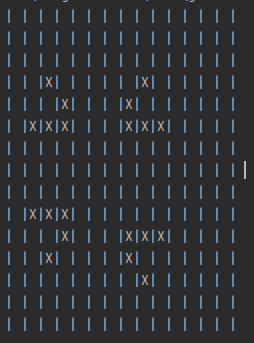
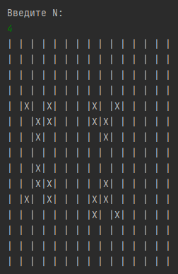
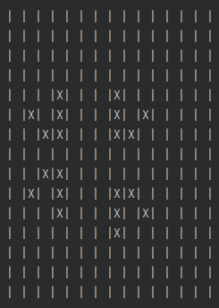
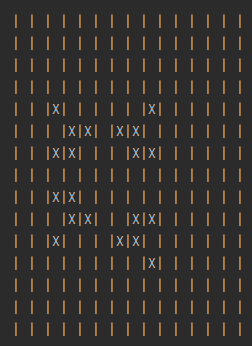
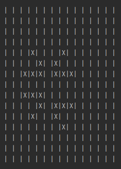

# simple_game_of_life_java

Классическая игра в жизнь, созданная Рубеном Кламером.

## Описание задачи

Клетка квадрата заполняется на шаге t в случае
а) если на шаге t-1 она была пустой, но были заполнены три соседние клетки или
б) если на шаге t-1 она была заполнена и были заполнены две или три соседние клетки.
Во всех остальных случаях клетка остается незаполненной или становится пустой.

Разработайте программу для моделирования поля размером 15X15 при условии, что в исходной позиции заняты клетки с координатами (3, 8), (4, 7), (5, 7), (5, 8), (5, 9), (10, 7), (10, 8), (10, 9), (11, 7), (12, 8), (3, 2), (4, 3), (5, 1), (5, 2), (5, 3), (9, 1), (9, 2), (9, 3), (10, 3), (11, 2).

Промоделируйте N шагов.

# Результат

Исходное значение полей

 

Результаты шагов (от первого до 4-ого)

 

 

 

